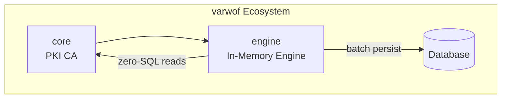

# varwof-engine

> In-memory-centric high-performance data subsystem for varwof-core: OCSP / CRL / nonce / certificate status with resident-memory queries and batch persistence.

> ⚠️ **Preview** — Not for production use. APIs and features may change before official release.

[](LICENSE)
[](https://pkg.go.dev/github.com/varwof/engine)

[中文](README_CN.md)

## What is varwof-engine?

An in-memory-centric high-speed data subsystem for varwof-core, providing resident-memory queries and batch persistence for OCSP / CRL / nonce / certificate status.

- **Memory is truth**: all high-frequency reads/writes hit in-memory indexes, zero SQL for reads
- **Batch persistence**: inherits varwof-core RecordBuffer (WAL crash safety / backpressure)
- **Time-window optimization**: OCSP/CRL pruned by certificate validity window
- **3-way dialect backend**: SQLite / PostgreSQL / MySQL
- **Single-instance authority**: v1 does not do distributed consensus

## Quick Start

```bash
go test -count=1 ./...
go build ./...
```

```go
import "github.com/varwof/engine/engine"

eng, _ := engine.New(engine.Options{...})
defer eng.Close()

// Memory write (immediately visible)
eng.IssueCert(record)

// Memory query (zero SQL)
status, _ := eng.GetCertStatus(serial)
```

## Installation

```bash
go get github.com/varwof/engine@v0.1.0
```

## Benchmark Performance

| Benchmark | Metric |
|-----------|--------|
| GetCertStatus | Hit ~230ns / miss ~45ns, zero SQL |
| IssueCertMemory | Memory write ~7.2µs/op |
| RecordBufferAdd | No WAL ~410ns, 0 allocs |
| CacheGetHit | Hit ~212ns, read-lock path |

## Ecosystem



engine is the **performance acceleration layer** of the varwof ecosystem. This project is a member of the [Open Invention Network](https://openinventionnetwork.com/).

## License & Commercial Use

`varwof-engine` is licensed under [AGPL-3.0](LICENSE). Organizations that cannot adopt AGPL may request a **commercial license**.

Varwof is an independent personal project. During the ecosystem-building period (target 1–2 years), the commercial license is **free and granted annually** (one-year terms, fee 0; renewal is decided by Varwof, free renewals during the free period). Use is unrestricted: unlimited instances, users, and issuance; embedding in products and SaaS is allowed. If fees are introduced, licensees receive 6 months' notice and may fall back to AGPL-3.0. **Not offered in the EU/EEA/UK/Switzerland.** The software is provided 'as is' without warranties of any kind; use is at your own risk.

Contact: **pki@varwof.com** | https://varwof.com

## Links

| | |
|---|---|
| Homepage | https://varwof.com |
| Community | https://varwof.org |
| IETF Draft | [draft-wei-aic-identity-cert](https://datatracker.ietf.org/doc/draft-wei-aic-identity-cert/) |
| License | AGPL-3.0 / Commercial |
| Member | [Open Invention Network](https://openinventionnetwork.com/) |
